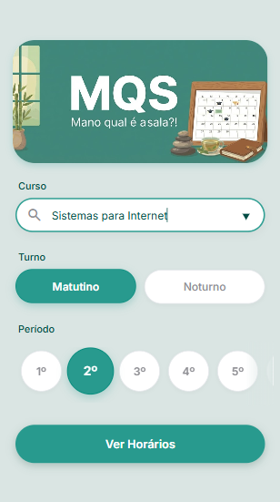
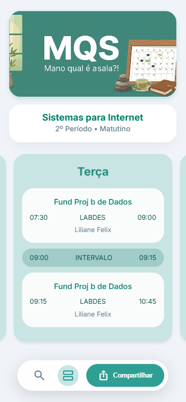

# 📍 MQS - Mano, Qual é a Sala?!

-success?style=for-the-badge)


> **Disciplina:** Introdução à Programação Web (Projeto Integrador)
>
> **Deploy:** [Acessar Aplicação](https://diegoaquinosza.github.io/MQS/)

## 1. O Projeto

O **MQS** é uma Aplicação Web *Mobile-First* desenvolvida com foco em **Eficiência de UX** e redução de carga cognitiva. O objetivo central é eliminar a "fricção tecnológica" que estudantes enfrentam para acessar sua grade horária, substituindo portais burocráticos por uma interface de acesso instantâneo.

**📉 O Problema:**
A desproporção entre esforço e resultado nos sistemas acadêmicos tradicionais. Para responder à simples pergunta *"Onde é a minha aula agora?"*, o aluno enfrenta barreiras desnecessárias: logins repetitivos, menus densos e interfaces não responsivas.

**🟢 A Solução:**
Um facilitador logístico que atua como um "colega digital". Através de persistência de dados local, o MQS memoriza o contexto do aluno e entrega a informação da sala em segundos, sem burocracia.

### 📸 Screenshots

| Tela Inicial (Onboarding) | Grade Horária (Card) |
|:---:|:---:|
|  |  |

---

## 2. Diferenciais Técnicos & UX

O projeto prioriza a experiência do usuário (UX) fundamentada em princípios de design:

* **Lei de Hick:** Redução drástica de opções na tela inicial para acelerar a decisão.
* **Persistência de Contexto (Warm Start):** Utiliza `localStorage` para lembrar o curso/turno. Ao reabrir o app, ele pula a configuração e vai direto à grade.
* **Design "Anti-Ansiedade":** Interface baseada no *Material Design 3*, utilizando cores frias (Teal/Ice Blue) e feedbacks visuais suaves.
* **Arquitetura Vanilla:** Desenvolvido sem frameworks (React/Vue), garantindo leveza extrema e carregamento instantâneo.

---

## 3. Funcionalidades Chave

1.  **Onboarding Inteligente:** Filtros de Curso/Turno/Período com UX otimizada (Scroll horizontal e Choice Chips).
2.  **Dashboard "Zen":** Visualização clara da aula atual com destaque visual para o dia da semana (Auto-Scroll).
3.  **Layout Adaptativo:** Transição fluida entre visualização de Cards (Mobile) e Grade Estendida (Desktop).
4.  **Snap & Share:** Geração automática de imagem (PNG) da grade horária para compartilhamento via WhatsApp/Galeria (Web Share API).
5.  **Offline Ready:** Estrutura preparada para PWA com manifesto e ícones configurados.

---

## 4. Stack Tecnológico

Este projeto foi construído seguindo a metodologia **"Vanilla First"**, garantindo performance e domínio da linguagem.

* **Front-end Core:** HTML5 Semântico, CSS3 (CSS Variables, Flexbox, Grid) e JavaScript (ES6+).
* **Bibliotecas:** `html2canvas` (Utilizada pontualmente para renderização de screenshots).
* **Design:** Figma (Prototipação) e Material Design 3 (Conceito).
* **Ferramentas:** VS Code, Git/GitHub.
* **Apoio Técnico (AI):** Google Gemini (Atuando como Code Reviewer e tutor para otimização de sintaxe e boas práticas).

---

## 5. Mapeamento Técnico & Checklist de Conformidade
📋 Checklist Obrigatório
Conforme solicitado nas diretrizes do Projeto Integrador:

[x] Estruturas básicas (condicionais, laços, funções).

[x] Objetos + Arrays com map/filter/reduce (≥ 3 métodos).

[x] Arrow functions (incluindo eventos).

[x] DOM dinâmico (criação/remoção/atualização; formulários e eventos).

[x] Requisição assíncrona com fetch + loading/erros.

[x] Promises (.then/.catch) e async/await (try/catch).

[x] Web Storage para persistência.

[x] +1 API HTML5 opcional (File/Geolocation/History/Canvas/Audio/Video/Clipboard).

[x] Responsivo + semântica + acessibilidade básica.

[x] Organização de arquivos e README completo.

### 🔍 Evidência de Implementação

Detalhamento de como os requisitos acima foram aplicados no código:

✅ **A. Objetos e Arrays (Manipulação Avançada)**
Superando o mínimo de 3 métodos, o arquivo app.js utiliza:

- .find(): Localiza o objeto do curso e a grade específica dentro da estrutura JSON.

- .filter(): Higieniza a grade, filtrando dias que não possuem aulas cadastradas.

- .map(): Essencial para a renderização do DOM, transformando dados brutos em componentes HTML (Cards de Dias e Listas de Aulas).

✅ **B. Assincronicidade (Dois Fluxos Distintos)**
Implementação de duas estratégias de consumo de dados para fins didáticos e práticos:

- Fluxo 1 (async/await + try/catch): Em app.js, a função fetchSchedule gerencia a busca crítica da grade, com tratamento de erros de rede e feedback visual de loading.

- Fluxo 2 (Promise .then/.catch): Em home.js, consome o arquivo tip_of_day.json para exibir frases aleatórias, com fallback automático em caso de falha.

✅ **C. Persistência e DOM**
- Web Storage: O estado do usuário (Curso/Turno) é salvo no localStorage, permitindo o "Warm Start" (início imediato sem reconfiguração).

- DOM Dinâmico: A interface é 100% construída via JavaScript (sem recarregar a página), reagindo às interações de formulário e cliques.

✅ **D. APIs HTML5 Extras**
- History API: Manipulação da URL para navegação fluida sem refresh.

- Canvas API (via html2canvas): Utilizada para renderizar a grade como imagem PNG.

- Web Share API: Integração com o sistema nativo de compartilhamento do dispositivo (WhatsApp/Telegram).

---

## 6. Estrutura de Arquivos

A arquitetura segue o princípio de Separação de Responsabilidades (SoC):
```text
/
├── index.html          # Onboarding (Home)
├── grade.html          # Visualização da Grade
├── styles.css          # Design System Global
├── home.css            # Estilos específicos da Home
├── home.js             # Lógica da Home (Validação + LocalStorage)
├── app.js              # Motor da Grade (Async + Renderização)
├── db.json             # Base de dados (JSON)
├── tip_of_day.json     # Micro-serviço de frases
└── assets/             # Imagens e ícones
```
---

## 7. Decisões Técnicas e Limitações
Arquitetura de Dados (Client-Side): Utilizamos arquivos JSON locais (db.json) como fonte de dados para simular uma API RESTful.

* **Implicação:** A aplicação opera em modo "Somente Leitura".

* **Zero Login:** Para eliminar fricção, a autenticação foi substituída pela persistência local de contexto.

* **CORS:** Devido às políticas de segurança dos navegadores (file:// protocol), o projeto necessita de um servidor HTTP local para carregar os arquivos JSON.

---

## 8. Como Executar
Para garantir o funcionamento das requisições fetch:

1. Clone o repositório.

2. Não abra diretamente pelo arquivo (file://).

3. Utilize um servidor local. Sugestão VS Code:

    * Instale a extensão **Live Server**.
    * Clique em "Go Live" no canto inferior direito.

4.  Ou via terminal (Node.js):
    ```bash
    npx http-server .

---

## 9. Declaração de Autoria
Declaro que este código foi desenvolvido por mim. Ferramentas de IA (Google Gemini) foram utilizadas de forma ética para:

1. **Code Review:** Análise de erros de sintaxe e lógica.

2. **Brainstorming:** Ideação de arquitetura CSS e refinamento de fluxos de UX.

Toda a lógica de negócio, estrutura de dados e identidade visual são autorais.

---
**Desenvolvido por:** Diego Aquino Souza